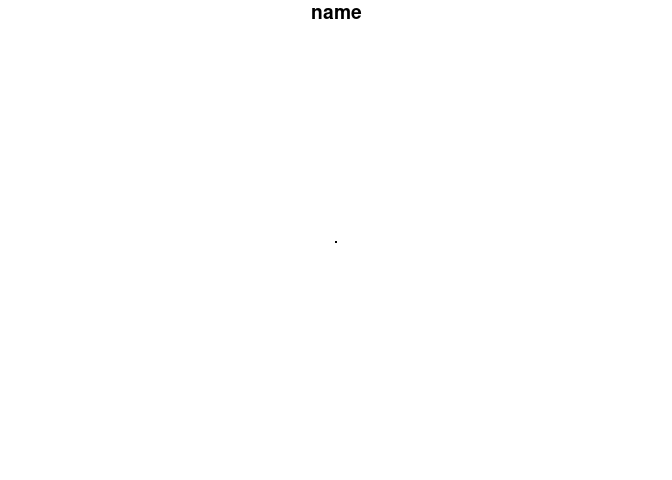

# zonebuilder

A rust crate for building zones.

It is an experimental and in-progress project to implement the
functionality in the
[`zonebuilder`](https://zonebuilders.github.io/zonebuilder/) R package
in the systems programming language Rust.

Why?

-   It should eventually enable more people to benefit from free and
    open source software for creating zoning systems because Rust
    enables the creation of binaries for Windows, Mac and the free and
    open source Linux operating system on which the package was
    originally developed (Rust can also compile to
    [WASM](https://webassembly.org/) enabling complex applications such
    as [A/B Street](https://github.com/a-b-street/abstreet) to run in
    browser — the thinking being if that can run in browser surely as
    simple application to build zones can!)
-   Computational efficiency: the process of building zones is not
    particularly computationally intensive but this Rust crate may
    eventually be fast and quick to install and use, possibly from
    higher level languages such as R using Rust interfaces such as
    [`extendr`](https://github.com/extendr/extendr)
-   For fun and education: as a simple crate it serves as a good way to
    show how Rust code is organised and how it works

To reproduce the example shown here you need to have the rust toolchain
installed.

Assuming you do, you can run the code as follows

### Clone the repo

``` bash
git clone https://github.com/zonebuilders/zonebuilder-rust.git
cd zonebuilder-rust
git checkout circles
```

    ## Cloning into 'zonebuilder-rust'...
    ## Switched to a new branch 'circles'
    ## Branch 'circles' set up to track remote branch 'circles' from 'origin'.

### Run the CLI

The `zonebuilder` software is shipped as a binary command line interface
that can by called from Windows, Mac and Linux system shells as follows:

``` bash
cargo build
```

    ##     Finished dev [unoptimized + debuginfo] target(s) in 0.02s

You can see instructions on using the tool with the following command:

``` bash
./target/debug/zonebuilder -h
```

    ## zb 0.1.0
    ## Build zones
    ## 
    ## USAGE:
    ##     zonebuilder [OPTIONS]
    ## 
    ## FLAGS:
    ##     -h, --help       Prints help information
    ##     -V, --version    Prints version information
    ## 
    ## OPTIONS:
    ##     -d, --distances <distances>...
    ##             Distances between concentric rings. First 5 values of the triangular number sequence by default, entered as
    ##             -d 1.0,3.0,6.0,10.0,15.0 [default: 1.0,3.0,6.0,10.0,15.0]
    ##     -c, --n-circles <n-circles>                  Set n_circles [default: 5]
    ##     -s, --num-segments <num-segments>            Number of radial segments (12 by default) [default: 12]
    ##     -v, --num-vertices-arc <num-vertices-arc>    Number of vertices per arc [default: 5]
    ##     -p, --precision <precision>
    ##             Number of decimal places in the resulting output (GeoJSON) files. Set to 6 by default. Larger numbers mean
    ##             more precision but larger file sizes [default: 6]

Let’s try making zones with fewer segments:

``` bash
./target/debug/zonebuilder -s 3 > zones.geojson
```

The result:

<!-- -->

``` bash
./target/debug/zonebuilder --precision 0 > zones.geojson
```

Results in this:

<!-- -->

``` bash
cargo run > zones.geojson
```

    ##     Finished dev [unoptimized + debuginfo] target(s) in 0.02s
    ##      Running `target/debug/zonebuilder`

Take a look at the output:

``` bash
head -n 20 zones.geojson
```

    ## {
    ##   "features": [
    ##     {
    ##       "geometry": {
    ##         "coordinates": [
    ##           [
    ##             [
    ##               1.0,
    ##               0.0
    ##             ],
    ##             [
    ##               0.994521,
    ##               0.104528
    ##             ],
    ##             [
    ##               0.978147,
    ##               0.207911
    ##             ],
    ##             [
    ##               0.951056,

Then read in the GeoJSON file with another tool, e.g. R (this step runs
from an R console that has the `sf` library installed):

``` r
zones = sf::read_sf("zones.geojson")
plot(zones)
```

<!-- -->

``` r
# interactive version:
# mapview::mapview(zones)
file.remove("zones.geojson")
```

    ## [1] TRUE

You can generate the same plot in R with the `zonebuilder` package as
follows:

``` r
zones = zonebuilder::zb_zone(x = "london", n_circles = 5)
```

    ## Loading required namespace: tmaptools

    ## although coordinates are longitude/latitude, st_within assumes that they are planar

``` r
plot(zones$geometry)
```

<!-- -->

<!-- ## Tidy up -->
<!--
The crate template was made with the following command:

```bash
cargo new --lib zonebuilder
```

```bash
mv -v zonebuilder/* .               
# renamed 'zonebuilder/Cargo.toml' -> './Cargo.toml'
# renamed 'zonebuilder/src' -> './src'
```

Edit the .rs files in src folder.

Then run:

```bash
cargo test
```

-->
