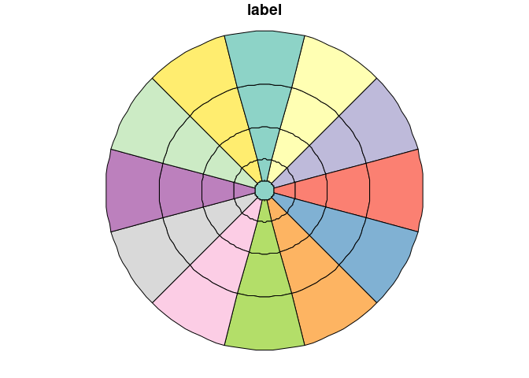

# zonebuilder

A rust crate for building zones.

To reproduce the example shown here you need to have the rust toolchain
installed.

Assuming you do, you can run the code as follows

## Clone the repo

``` bash
git clone https://github.com/zonebuilders/zonebuilder-rust.git
cd zonebuilder-rust
git checkout circles
```

    ## fatal: destination path 'zonebuilder-rust' already exists and is not an empty directory.
    ## Already on 'circles'
    ## Your branch is up-to-date with 'origin/circles'.

Run the CLI:

``` bash
cargo run > circle.geojson
```

    ## warning: variable does not need to be mutable
    ##   --> src/lib.rs:55:9
    ##    |
    ## 55 |     let mut features: Vec<Feature> = polygons
    ##    |         ----^^^^^^^^
    ##    |         |
    ##    |         help: remove this `mut`
    ##    |
    ##    = note: `#[warn(unused_mut)]` on by default
    ## 
    ## warning: 1 warning emitted
    ## 
    ##     Finished dev [unoptimized + debuginfo] target(s) in 0.02s
    ##      Running `target/debug/zonebuilder`

Take a look at the output:

``` bash
head -n 20 circle.geojson
```

    ## {
    ##   "features": [
    ##     {
    ##       "geometry": {
    ##         "coordinates": [
    ##           [
    ##             [
    ##               1.0,
    ##               0.0
    ##             ],
    ##             [
    ##               0.866025,
    ##               0.499999
    ##             ],
    ##             [
    ##               0.5,
    ##               0.866025
    ##             ],
    ##             [
    ##               0.0,

Then read in the GeoJSON file with another tool, e.g. R:

``` r
circle = sf::read_sf("circle.geojson")
plot(circle)
```

<!-- -->

``` r
file.remove("circle.geojson")
```

    ## [1] TRUE

<!-- ## Tidy up -->
<!--
The crate template was made with the following command:

```bash
cargo new --lib zonebuilder
```

```bash
mv -v zonebuilder/* .               
# renamed 'zonebuilder/Cargo.toml' -> './Cargo.toml'
# renamed 'zonebuilder/src' -> './src'
```

Edit the .rs files in src folder.

Then run:

```bash
cargo test
```

-->
