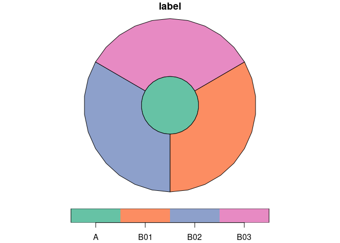

[](https://crates.io/crates/zonebuilder)

# zonebuilder

A rust crate for building zones.

It is an in-progress project to implement the functionality in the
[`zonebuilder`](https://zonebuilders.github.io/zonebuilder/) R package
in the systems programming language Rust.

Why?

-   It should eventually enable more people to benefit from free and
    open source software for creating zoning systems because Rust
    enables the creation of binaries for Windows, Mac and the free and
    open source Linux operating system on which the package was
    originally developed
-   To enable deployment of the zonebuilder techniques online, as
    demonstrated in the [web](web) folder (Rust can also compile to
    [WASM](https://webassembly.org/) enabling complex applications such
    as [A/B Street](https://github.com/a-b-street/abstreet) to run in
    browser — the thinking being if that can run in browser surely as
    simple application to build zones can!)
-   Computational efficiency: the process of building zones is not
    particularly computationally intensive but this Rust crate may
    eventually be fast and quick to install and use, possibly from
    higher level languages such as R using Rust interfaces such as
    [`extendr`](https://github.com/extendr/extendr)
-   For fun and education: as a simple crate it serves as a good way to
    show how Rust code is organised and how it works

# Installation of the Rust crate

To install the `zonebuilder` crate, you need first [install
Rust](https://doc.rust-lang.org/cargo/getting-started/installation.html).
Install the latest version on crates.io with

``` bash
cargo install zonebuilder
```

You can install the development version as follows:

``` bash
cargo install --git https://github.com/zonebuilders/zonebuilder-rust --branch main
```

## Download and run binaries

Rust can create binaries for all major operating systems. Watch this
space for how to run zonebuilders using a binary (no compilation or Rust
toolchain required).

# Running zonebuilder from the system command line

The `zonebuilder` binary has a command line interface. Assuming you are
installing the crate locally, you can build the binary for Windows, Mac
and Linux system shells as follows:

``` bash
cargo build
```

    ##     Finished dev [unoptimized + debuginfo] target(s) in 0.02s

You can see instructions on using the tool with the following command:

``` bash
./target/debug/zonebuilder -h
```

    ## zb 0.1.0
    ## Configures a clockboard diagram
    ## 
    ## USAGE:
    ##     zonebuilder [FLAGS] [OPTIONS]
    ## 
    ## FLAGS:
    ##     -h, --help         Prints help information
    ##         --projected    Is the data projected?
    ##     -V, --version      Prints version information
    ## 
    ## OPTIONS:
    ##     -d, --distances <distances>...
    ##             The distances between concentric rings. `triangular_sequence` is useful to generate these distances
    ##             [default: 1.0,3.0,6.0,10.0,15.0]
    ##     -s, --num-segments <num-segments>
    ##             The number of radial segments. Defaults to 12, like the hours on a clock [default: 12]
    ## 
    ##     -v, --num-vertices-arc <num-vertices-arc>
    ##             The number of vertices per arc. Higher values approximate a circle more accurately [default: 10]
    ## 
    ##     -p, --precision <precision>
    ##             The number of decimal places in the resulting output GeoJSON files. Set to 6 by default. Larger numbers mean
    ##             more precision, but larger file sizes [default: 6]

Let’s try making zones with fewer segments and circles (specified by the
`-s` and `-d` arguments respectively):

``` bash
./target/debug/zonebuilder -s 3 -d 1.0,3.0 > zones.geojson
```

The The result looks like this:

<!-- -->

You can also set the precision of outputs. The default is 6 decimal
places, as shown in the output below:

``` r
head(sf::st_coordinates(z))
```

    ##             X        Y L1 L2
    ## [1,] 0.000000 0.009043  1  1
    ## [2,] 0.001867 0.008846  1  1
    ## [3,] 0.003653 0.008261  1  1
    ## [4,] 0.005280 0.007316  1  1
    ## [5,] 0.006675 0.006051  1  1
    ## [6,] 0.007779 0.004521  1  1

Let’s see the output when a precision of 2 decimal places is used:

``` bash
./target/debug/zonebuilder --precision 2 > zones.geojson
```

That results in this:

<!-- -->

You can run the crate as follows (note the use of `--` to pass the
arguments to the zonebuilder binary not `cargo run`):

``` bash
cargo run -- --precision 3 > zones.geojson
```

    ##     Finished dev [unoptimized + debuginfo] target(s) in 0.02s
    ##      Running `target/debug/zonebuilder --precision 3`

Take a look at the output:

``` bash
head -n 20 zones.geojson
```

    ## {
    ##   "features": [
    ##     {
    ##       "geometry": {
    ##         "coordinates": [
    ##           [
    ##             [
    ##               0.0,
    ##               0.009
    ##             ],
    ##             [
    ##               0.0,
    ##               0.009
    ##             ],
    ##             [
    ##               0.0,
    ##               0.008
    ##             ],
    ##             [
    ##               0.001,

Then read in the GeoJSON file with another tool, e.g. R (this step runs
from an R console that has the `sf` library installed):

``` r
zones = sf::read_sf("zones.geojson")
plot(zones)
```

<!-- -->

``` r
# interactive version:
# mapview::mapview(zones)
file.remove("zones.geojson")
```

    ## [1] TRUE

You can generate the same plot in R with the `zonebuilder` package as
follows:

``` r
zones = zonebuilder::zb_zone(x = "london", n_circles = 5)
```

    ## Loading required namespace: tmaptools

``` r
plot(zones$geometry)
```

<!-- -->

<!-- ## Tidy up -->
<!--
The crate template was made with the following command:

```bash
cargo new --lib zonebuilder
```

```bash
mv -v zonebuilder/* .               
# renamed 'zonebuilder/Cargo.toml' -> './Cargo.toml'
# renamed 'zonebuilder/src' -> './src'
```

Edit the .rs files in src folder.

Then run:

```bash
cargo test
```

-->
